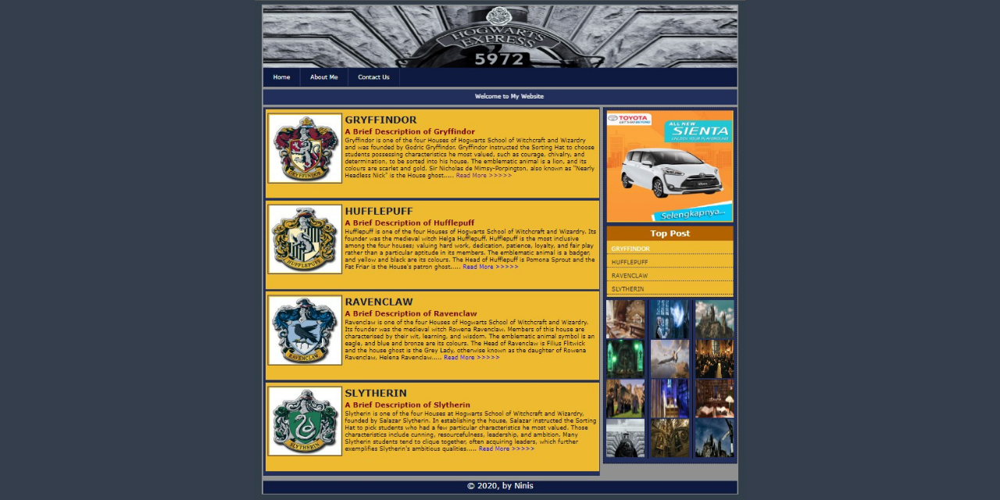

# ‘Harry Potter: Hogwarts’ Theme Website using PHP, HTML, and CSS Programming Languages
This is a project of the Web Programming course. This simple web with the 'Harry Potter: Hogwarts' theme was the first website that I created using PHP, HTML, and CSS programming languages. This web contains a home, about me, and contact us page with several images, links, and also ads on the side of the page. The contact us page is created using an HTML form and PHP programming language and all the user input will be saved and linked to the database, to open the home page of this web, you may run the index7.html file but to access this web is still using localhost.

